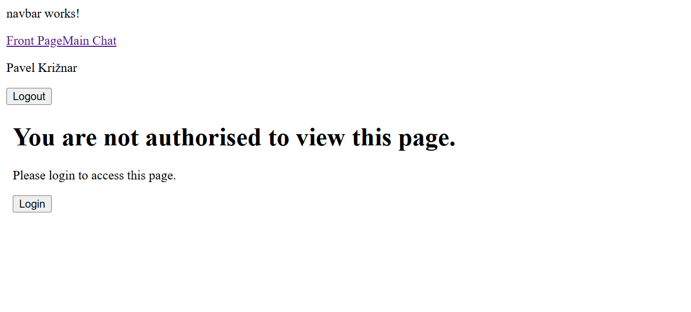

# TODO

## Authentication
- check if session is still valid in guard and redirect to login if not, with returnUrl
- keycloak occasionally refusing connection, investigate and fix

## Styling
- make custom keycloak theme
https://docs.redhat.com/en/documentation/red_hat_build_of_keycloak/22.0/html-single/server_developer_guide/index#themes

## Custom robot avatar
- create custom avatar for robot, maybe with some animation
- on bottom of message bubble

## Fix backend database session initialization